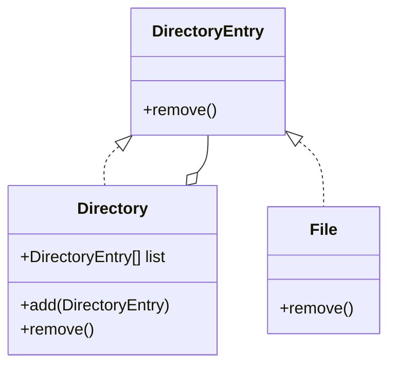

```mermaid
classDiagram
    class DirectoryEntry {
        +remove()
    }

    class Directory {
        +DirectoryEntry[] list
        +add(DirectoryEntry)
        +remove()
    }

    class File {
        +remove()
    }

    DirectoryEntry <|.. Directory
    DirectoryEntry <|.. File
    Directory o-- DirectoryEntry
```
